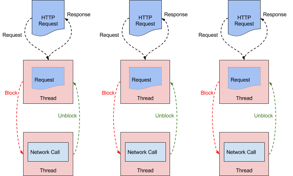
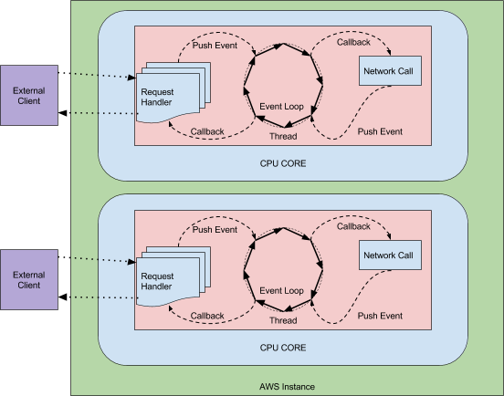

# mvc-vs-webflux

Esse projeto tem como fim demonstrar o comportamento de uma mesma aplicação utilizando o Spring MVC e utilizando Spring WebFlux.

## Diferenças

Spring MVC é baseado em threads bloqueantes, utilizando como base nesse caso o servidor http apache tomcat.



Spring WebFlux é baseado em threads não bloqueantes através de event loop, utilizando como base nesse caso o servidor http netty.



## Stack

### - Linguagem
Utiliza o Kotlin rodando sob a JDK 14.

### - Gerenciador de dependência
Utiliza Gradle, wrapper na pasta do projeto.

### - Framework
Utiliza o framework Spring, com spring boot e em um dos projetos utiliza como dependência Web o Spring MVC e em outro o Spring WebFlux.

### - Database 
Utiliza o MongoDB, para subir uma nova instância no docker:

```sh
docker run -it -p 27017:27017 mongo:4.4
```

### - Medição de Threads/Comportamento
Utilizar o plugin de preferência, nesse caso recomendado utilizar o plugin VisualVM do Intellij.

### - Testes
Para executar os testes pode-se utilizar o JMETER

Você pode fazer o download dele: https://jmeter.apache.org/download_jmeter.cgi

## Massa de dados

Como massa de dados, vamos considerar um cenário em que você tem uma volumetria muito grande de tweets sendo capturada em tempo real, esses tweets possuem o formato abaixo:

```json
{
    "py/object": "twint.tweet.tweet",
    "id": 444,
    "id_str": "444",
    "conversation_id": "4445",
    "datetime": "2021-02-15 22:55:46 Hora oficial do Brasil",
    "datestamp": "2021-02-15",
    "timestamp": "22:55:46",
    "user_id": 123,
    "user_id_str": "123",
    "username": "xxx",
    "name": "xxx",
    "place": "",
    "timezone": "-0300",
    "mentions": [],
    "reply_to": [],
    "urls": [],
    "photos": [],
    "video": 0,
    "thumbnail": "",
    "tweet": "Fato",
    "lang": "pt",
    "hashtags": [],
    "cashtags": [],
    "replies_count": 0,
    "retweets_count": 0,
    "likes_count": 0,
    "link": "https://twitter.com/xxx/status/1336301637233745922",
    "retweet": false,
    "retweet_id": "",
    "retweet_date": "",
    "user_rt": "",
    "user_rt_id": "",
    "quote_url": "",
    "near": "",
    "geo": "",
    "source": "",
    "translate": "",
    "trans_src": "",
    "trans_dest": ""
}
```

Você pode usar esse mesmo tweet de exemplo para inserir várias vezes na sua base dados, não é necessário criar mais massa.

## Executando os testes

Após subir toda a stack na máquina local, faça o teste de performance em cada uma das aplicações separadamente com o JMETER, mudando apenas a porta (8080 para MVC e 8081 para WebFlux).

Você pode usar o script `Plano de Teste.jmx` dentro do seu JMETER.

O comportamento pode ser diferente de acordo com seu Setup (computador), por isso teste com diferentes volumetrias em "Grupo de Usuários" dentro do JMETER e veja o comportamento das Threads no Visual VM.

Limite a quantidade mínima e máxima de memória da JVM, isso deixará os testes mais interessantes e intensos:

```
-Xms64M -Xmx128M
```

## Apresentação em slide:
https://pt.slideshare.net/soterocra/introduo-ao-webflux

## Apresentação em vídeo:
(Pendente)

## Links:

Artigo sobre non-blocking em bases relacionais: https://technology.amis.nl/software-development/performance-and-tuning/performance-of-relational-database-drivers-r2dbc-vs-jdbc/

Artigo Netflix sobre o tema: https://netflixtechblog.com/zuul-2-the-netflix-journey-to-asynchronous-non-blocking-systems-45947377fb5c

Melhor introdução de WebFlux gratuita da internet: https://www.youtube.com/watch?v=uLFU5Uou5t4&list=PL62G310vn6nH5Tgcp5q2a1xCb6CsZJAi7

Artigo muito didático de introdução ao WebFlux: https://www.baeldung.com/spring-webflux-concurrency

Artigo bacana: https://gist.github.com/staltz/868e7e9bc2a7b8c1f754